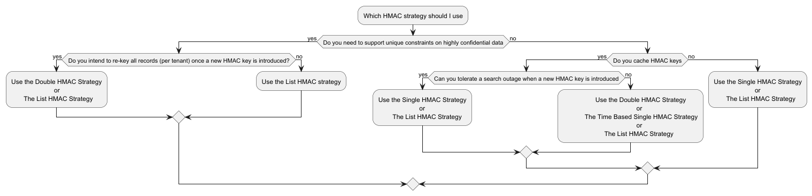

# Appendixes

## A: Decisioning diagram for which HMAC strategy to use

## B: Possible re-keying process when using list HMAC strategy when the application need to delete a specific HMAC key

When your application mostly runs on key rotation without rekeying, but you need to support a process whereby a HMAC key
needs to
be completely removed from the system then you can follow
steps similar to below:

Terminology:
Deprecated HMAC Key: HMAC key that you want to completely remove from your system.

Substitute key: The HMAC key that was next introduced to the system after the deprecated key was originally introduced.

1. Run a query which finds records that have HMACs calculated with the key that's getting removed but do not have HMACs
   generated with the next most recent key (e.g. if you're
   removing the oldest HMAC key then find records that have HMACs calculated with that key but have no HMACs calculated
   with the second oldest key).
2. For each record generate HMACs with the substitute key and save them to the record (or to both the LOOKUP and
   UNIQUE_VALUES table if using separate SQL tables)
3. Delete the HMAC key to be removed from the system.
4. Delete the HMACs calculated with the deleted HMAC key from all records.

### Case study for an application which uses the List HMAC Strategy and has the unique constraint challenge

Background: ACME unique application is an application that relies solely on HMAC key rotation (without rekeying) to
manage the
keying of records over time. ACME application also requires
unique constraints on highly confidential fields, so it uses the List HMAC Strategy. The application introduces a new
HMAC key into the system every year. After 4 years it is
required to remove the oldest HMAC key from the system. ACME application data is long-lived and so it's not possible to
rely on data retention rules to simply delete records that
used the old HMAC key so a re-keying job is necessary.

* ACME application always has 4 HMAC keys in use at any one time. Currently, it is year 8 of the application's lifetime
  so the HMACs keys are HMAC_KEY_5, HMAC_KEY_6, HMAC_KEY_7,
  HMAC_KEY_8. (This corresponds to the 2nd last column in the diagram below)
* At the start of year 9 (last column in the table below) a new HMAC key (HMAC_KEY_9) is introduced to the system (
  meaning that temporarily there are now 5 HMAC keys in use).
* A background re-keying task is then kicked off. We need to remove HMAC_KEY_5 from the system as it's now too old.
* The re-keying job executes a batched query. This query looks for records that do not have HMACs calculated with
  HMAC_KEY_6, which is now the oldest allowed HMAC key.
    * When using the List HMAC Strategy correctly, this would be records that were written up to and during the 5th year
      which was the year before HMAC_KEY_6 was introduced into
      the system. During that 5th year all records would have been written with keys HMAC_KEY_2, HMAC_KEY_3, HMAC_KEY_4,
      HMAC_KEY_5. So those records wouldn't have any HMACs calculated
      with HMAC_KEY_6. But in the year after that (year 6), the system would have keyed off the oldest HMAC key (at that
      time HMAC_KEY_2) and records would have started to get written
      with keys HMAC_KEY_3, HMAC_KEY_4, HMAC_KEY_5 and HMAC_KEY_6.
* For each record found, the application decrypts the record, calculates any HMACS with HMAC_KEY_6 and inserts those new
  HMACs into the record LOOKUP and UNIQUE_VALUES lists.
* When all records have been modified as above, HMAC_KEY_5 is deleted from the system.
* All HMAC entries that were made with HMAC_KEY_5 are removed from every record in the system.

You can see that using this strategy that the re-keying job has to re-key an increasing number of records each year.

**Key points about the diagram above:**

In each year, HMAC keys with a strikethrough depict the deprecated HMAC keys that are getting keyed off and subsequently
deleted.

The => symbol depicts a re-key operation from the deprecated HMAC key to the next most recent HMAC key.

Observations on the table above:

Notice that as the years go on (as we go right through the columns) that the number of blocks with a re-key operation (
depicted using the => symbol) grows? This is a visualization
of the fact that over time the re-key job will have more and more periods of records to re-key, so the re-key job will
get progressively slower over time.

Visually the diagram shows us that in order to guarantee uniqueness enforcement, all cells in a column must share at
least one number. We can see that using this re-keying approach
this number is always the current oldest HMAC key number.

With keys having a rotation period of 1 year and an expiry of 4 years there will mostly be 4 active HMAC keys in use at
all times (excluding the first 3 years).
The only exceptions to this is when a new HMAC key is introduced there will be 5 HMAC keys in use until the re-keying
job is finished and the oldest key is deleted. So each year
the HMAC key list will temporarily grow to 5 keys and shrink back to 4.

In any year, there are only ever a maximum of N-1 periods which don't need re-keying.

The approach to using 4 HMAC keys (as in this example) might not make much sense in the end. Using 2 keys and
just doing a full re-key to the new key each year would most
likely make more sense. The reason being is that as the application continues in time the number of periods that need
re-keyed will be much greater than the number that don't (in
this case 3). But the normal day-to-day operations of the application will always need to calculate 4 HMACs for every
operation (5 during a re key), which will have a negative
impact on performance. If you switch to just having a single active HMAC key and changing it every year the normal
performance of the app will improve as it will only have to
calculate a single HMAC for every operation (2 during a re key). This will come at the expense of the re-keying job
having to do 3 extra periods, which would likely be an
acceptable trade off.